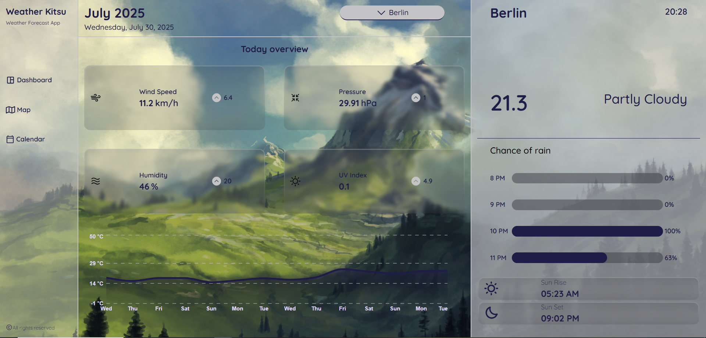
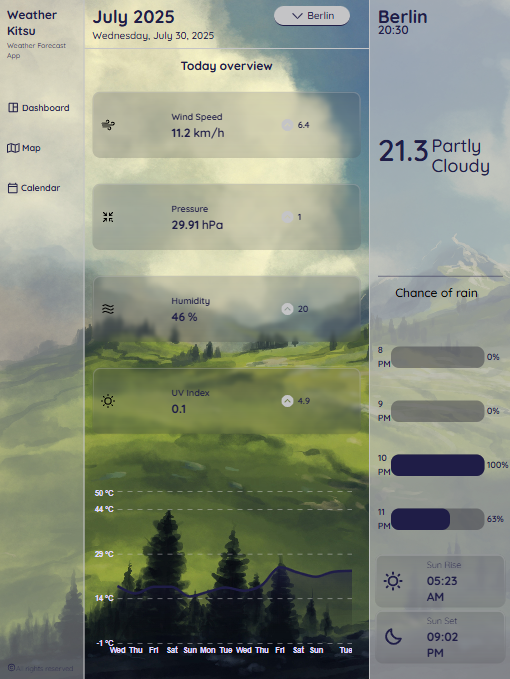
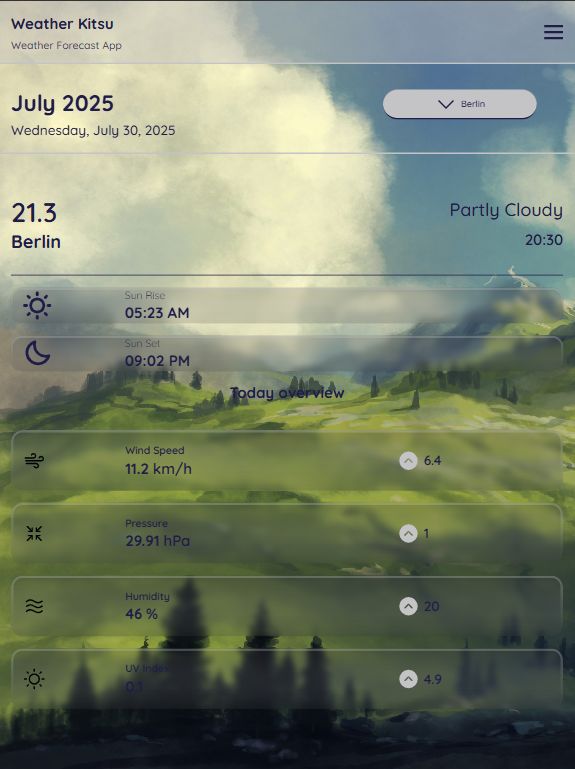
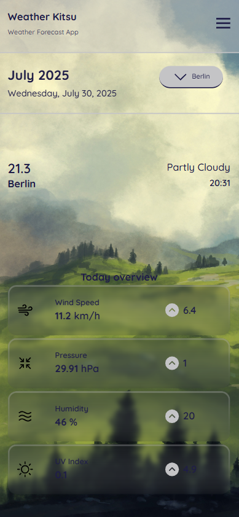
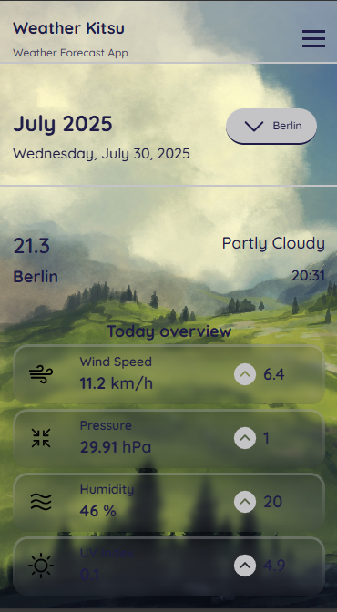

# Weather Kitsu - Weather Forecast App

![Weather Kitsu Banner/Hero Image - Optional]

A modern and responsive Single Page Application (SPA) built to provide real-time weather forecasts for selected cities. Weather Kitsu offers a clean, intuitive interface with detailed weather information, adapting seamlessly across various devices.

## Features

* **Real-time Weather Data:** Get up-to-the-minute weather conditions for your chosen location.
* **City Selection:** Easily switch between different cities to view their forecasts.
* **Detailed Overview:** Displays key weather metrics like wind speed, pressure, humidity, and UV index.
* **Hourly Rain Probability (Desktop/Tablet):** Visualized chance of rain for the upcoming hours.
* **Daily Temperature Chart (Desktop/Tablet):** A visual representation of temperature trends over the week.
* **Sunrise & Sunset Times:** Essential astronomical information at a glance.
* **Fully Responsive Design:** Optimized user experience across desktops, tablets, and mobile devices.
* **Modern UI/UX:** Built with a sleek, minimalist design using Tailwind CSS.

## Technologies Used

* **HTML & CSS:** For the fundamental structure and styling.
* **JavaScript (ES6+):** Core logic and interactivity.
* **React.js:** A declarative, efficient, and flexible JavaScript library for building user interfaces.
* **Tailwind CSS:** A utility-first CSS framework for rapidly building custom designs.
* **Recharts:** A composable charting library built on React components for displaying data visualizations.
* **React Query:** For powerful data fetching, caching, and state management.
* **Context API:** For global state management across the application.
* **Weather API:** Integration with a reliable weather API to fetch forecast data.

## Screenshots

Here are some screenshots showcasing Weather Kitsu on different devices:

### Desktop View


### iPad Pro View


### iPad Mini View


### iPhone Pro View


### iPhone SE View


## Getting Started

To get a local copy up and running, follow these simple steps.

### Prerequisites

* Node.js (LTS version recommended)
* npm or Yarn

### Installation

1.  Clone the repository:
    ```bash
    git clone [https://github.com/KitsuneTheDev/weather-app.git](https://github.com/KitsuneTheDev/weather-app.git)
    ```
2.  Navigate to the project directory:
    ```bash
    cd weather-app
    ```
3.  Install dependencies:
    ```bash
    npm install
    # or
    yarn install
    ```
4.  Set up your API key:
    * Obtain a weather API key from [mention your chosen Weather API provider, e.g., OpenWeatherMap, WeatherAPI.com].
    * Create a `.env` file in the root of the project.
    * Add your API key to the `.env` file like so:
        ```
        REACT_APP_WEATHER_API_KEY=YOUR_API_KEY_HERE
        ```

### Running the Application

To start the development server:

```bash
npm start
# or
yarn start
```

The application will open in your browser at http://localhost:3000.

## Contributing
* Contributions are what make the open-source community such an amazing place to learn, inspire, and create. Any contributions you make are greatly appreciated.

* If you have a suggestion that would make this better, please fork the repo and create a pull request. You can also simply open an issue with the tag "enhancement".
Don't forget to give the project a star! Thanks again!

* Fork the Project

* Create your Feature Branch (git checkout -b feature/AmazingFeature)

* Commit your Changes (git commit -m 'Add some AmazingFeature')

* Push to the Branch (git push origin feature/AmazingFeature)

* Open a Pull Request

## License
Distributed under the MIT License. See LICENSE for more information.

## Contact
KitsuneTheDev - [Your GitHub Profile Link] (e.g., https://github.com/KitsuneTheDev)

Project Link: https://github.com/KitsuneTheDev/weather-app